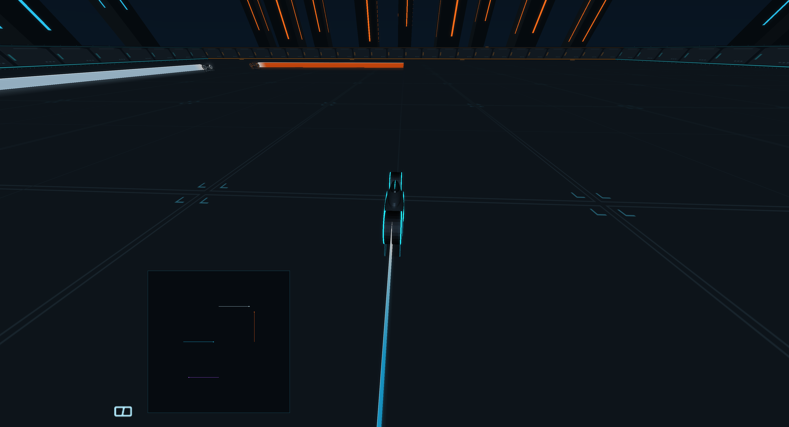

# VulkanTron


**A cinematic lightcycle arena built on GLTron's faithful direct-Vulkan port.**
Version **0.3.0** introduces **Obsidian**: a dark arena with luminous cycle
silhouettes, cyan and amber architecture, new energy trails and impacts,
approximate floor reflections, and bloom confined to each player's view.
Its theme is the user-provided **Forward Pulse**. The original **Obsidian Circuit**
YuE2 study remains selectable; the engine, boost and crash sounds are newly
synthesized.



VulkanTron retains the original game rules, AI, controls, menus, cameras, and
local multiplayer layouts. Classic and faithful artpacks remain selectable,
with the original models, effects and music available. SDL3 handles windows,
input, controllers, and audio.
The renderer uses Vulkan directly; it does not use SDL_GPU or an OpenGL driver.

The preserved OpenGL remaster is included as a comparison executable. The
initial simplified Vulkan arena is now a separate development tool,
`vulkantron-lab`; the normal `vulkantron` executable runs the complete game.

Version **0.2.0** completed the faithful full-game port on the tested Linux
system. Its native OpenGL/Vulkan comparison covered original and faithful
artpacks, with documented coplanar depth differences in three explosion
fixtures. The **0.3.0 Obsidian release passed 21 Release and 21 sanitizer tests,
native X11/Wayland arena captures, and installed gameplay/audio checks**.
The original artpack also passed the strict 39-scene renderer comparison.
Audio files pass technical checks; a subjective listening review has not been
recorded. Obsidian's reflection treatment is an
artistic approximation, and its bloom is limited to the game views.
See the [renderer architecture](docs/VULKANTRON_RENDERER.md),
[development plan](docs/VULKANTRON_PLAN.md), and
[faithful verification](docs/VULKANTRON_VERIFICATION.md) and
[Obsidian verification](docs/OBSIDIAN_VERIFICATION.md) for scope and evidence.
Linux is the tested platform; other operating systems require their own ports
and verification.

## Build and play

Required: a C99/C++20 compiler, CMake 3.21 or newer, Ninja, pkg-config, SDL3 3.2
or newer, Vulkan headers and loader, `glslc`, `spirv-val`, libpng, zlib, and
libmikmod. Lua 4.0.1 is bundled. The shared build also needs OpenGL development
files for the retained reference executable.

The graphics baseline is Vulkan 1.3 with dynamic rendering and synchronization2.
The faithful renderer uses a depth/stencil attachment and swapchain transfer
support. Classic smooth lines use the optional line-rasterization extension;
unsupported requested features produce a clear error. The development target
is the NVIDIA GeForce GTX 1660. Broader GPU support requires separate testing.

On Arch Linux, `shaderc` supplies `glslc`, `spirv-tools` supplies `spirv-val`,
and `vulkan-validation-layers` supplies the optional Khronos validation layer.

```sh
./run-vulkantron.sh
```

The helper configures the release preset, builds the full game, and runs it.
It honors `VULKAN_SDK`; it also recognizes the optional user-local headers at
`~/.local/opt/vulkan-headers/1.4.357.0` on the development machine.
For a regular SDK installation, the equivalent commands are:

```sh
cmake --preset release
cmake --build --preset release
./build/release/bin/vulkantron
```

Use the original menus to start a game and configure controls, artpacks, music,
effects, cameras, and one-, two-, or four-player layouts. Useful options:

```sh
./build/release/bin/vulkantron --help
./build/release/bin/vulkantron --obsidian
./build/release/bin/vulkantron --validation
./build/release/bin/vulkantron -i -8
```

`--validation` requires the Khronos validation layer and fails explicitly if
it is unavailable. `-i -8` requests a 1280×720 window; the desktop may constrain
its actual size. In game, F5 saves preferences, F11 saves BMP, and F12 saves PNG.
`--obsidian` selects the arena and its bundled soundtrack for this session;
F5 makes that selection persistent. The artpack and soundtrack menus can select
the classic or faithful presentation at any time.

Default first-player controls are **A/S** to turn, **E** to boost, and **Q/W**
to glance. Existing saved bindings take precedence. Use arrows and Enter in
menus, Space to pause, Escape to return through menus, and F10 to cycle cameras.
F1/F2/F3/F4 select single, stacked, four-way, or automatic views. Player count
and all bindings remain configurable through the original menus.
Mouse Y uses normal direction by default. **Game > Play Settings > Invert Mouse Y**
switches to the original inverted direction immediately. Quit through the main
menu to save the choice, or press F5 while playing or paused.

## App-menu installation and preferences

After a full release build, install a separate user-local copy and launcher:

```sh
python3 tools/install_vulkantron_launcher.py --select-obsidian
```

The installer requires Python 3.11 or newer and `desktop-file-validate`. It
installs under `~/.local/opt/vulkantron`, adds `~/.local/bin/vulkantron`, and
creates the **VulkanTron** application entry with its own icon. It verifies
installed content and preserves previous versions. A fresh launcher profile
selects Obsidian and `song_forward_pulse.wav`. `--select-obsidian` also selects
these in an existing VulkanTron profile: it first saves a timestamped
`.gltronrc.pre-obsidian-*.bak` beside the profile, then atomically appends only
the artpack and soundtrack choices. Existing controls and other settings are
preserved. Omit the flag to retain an existing profile's current selections.

Preferences default to `~/.config/vulkantron/.gltronrc`; screenshots default to
`~/.local/state/vulkantron/screenshots`. The corresponding XDG environment
variables are honored. VulkanTron does not import or overwrite the remaster's
profile. Advanced overrides are:

- `VULKANTRON_DATA_DIR`: directory containing `art`, `data`, `music`, and `scripts`.
- `VULKANTRON_CONFIG_DIR`: directory for `.gltronrc`.
- `VULKANTRON_SCREENSHOT_DIR`: screenshot directory.
- `VULKANTRON_SHADER_DIR`: directory containing the compiled faithful shaders.

`GLTRON_DATA_DIR` remains supported for shared test assets; `VULKANTRON_DATA_DIR`
takes precedence. Profiles use VulkanTron's variables above. Installed executables find
assets and shaders relative to their location and can run from another working
directory.

## Tests and renderer comparison

```sh
cmake --build --preset release
ctest --preset release
cmake --preset asan
cmake --build --preset asan
ctest --preset asan
```

The suite covers original gameplay, cameras, local layouts, input, settings,
assets, audio, and dynamic trails. Vulkan-specific tests cover matrix and light
state, geometry recording, texture versions and mip uploads, readback packing,
and frame capture/lifetime behavior. CPU-only tests do not certify GPU output.
The sanitizer preset enables AddressSanitizer and UndefinedBehaviorSanitizer;
whole-program leak checking is separate.

For a real desktop comparison, build both native harnesses and capture the same
production game with a fixed clock and seed. The image checker additionally
needs NumPy and Pillow; see `tools/renderer-check-requirements.txt`:

```sh
cmake --preset release -DGLTRON_BUILD_NATIVE_TESTS=ON
cmake --build --preset release
python3 tools/check_vulkantron_faithful.py \
  --opengl build/release/vulkantron-reference-smoke \
  --vulkan build/release/vulkantron-faithful-smoke \
  --assets . --output /tmp/vulkantron-comparison --driver x11
```

The output directory must be new. The checker first requires repeated OpenGL
runs to match exactly, then compares game state, visual state, and full-size
images across renderers. It records real window transitions, settings
roundtrips, Vulkan validation, and diagnostic differences. Image metrics still
require visual review. `--driver wayland` tests native Wayland separately.

Run the OpenGL reference with `./build/release/bin/gltron`. Its original
instructions are retained in the [faithful README](docs/FAITHFUL_REFERENCE_README.md).
That executable uses the original GLTron profile unless `GLTRON_CONFIG_DIR` is
set. Reference-only builds can set `-DVULKANTRON_BUILD_DIRECT_RENDERER=OFF`.

## Learning renderer development

The [architecture guide](docs/VULKANTRON_RENDERER.md) follows production draw
calls through the state recorder to Vulkan textures, pipelines, synchronization,
and presentation. The adapter evaluates the classic vertex pipeline on the
CPU and submits its output through Vulkan. It is a specific implementation of
this game's drawing needs, not a general OpenGL replacement or a universal
engine. Future optimization should preserve the same reference fixtures and
be justified by measurements.

The earlier lab remains available after a full build:

```sh
./build/release/bin/vulkantron-lab --demo --overview --validation
./build/release/bin/vulkantron-lab --self-test
```

Its simplified visuals and controls are development aids. The full game's
menus and original presentation live in `vulkantron`.

## Credits and license

GLTron was created by Andreas Umbach and its original contributors. Original
artwork, models, fonts, and audio retain their authorship. **Revenge of Cats**
is copyright Peter Hajba (Skaven). See [asset provenance](docs/ASSET_PROVENANCE.md),
the original [README](README), and the retained in-game credits.

The program is distributed under the GNU General Public License, version 2 or
later, without warranty; see [COPYING](COPYING). Bundled Lua retains its separate
[copyright and permission notice](packaging/LUA-COPYRIGHT.txt). VulkanTron is a
fan project; no official TRON affiliation is claimed. Renderer work does not
transfer ownership of the original game's assets.

Obsidian's authored visuals have their own [asset record](art/obsidian/manifest.json).
The [audio notes](docs/OBSIDIAN_AUDIO.md) document the user-provided Forward Pulse
theme and preserve the earlier Obsidian Circuit prompt, seed, render settings,
synthesis method, hashes, and technical review limits. The installed YuE2 model
card identifies its weights as CC BY-NC 4.0; that metadata relates to the earlier
study's model, separately from Forward Pulse and the original game's asset credits.
