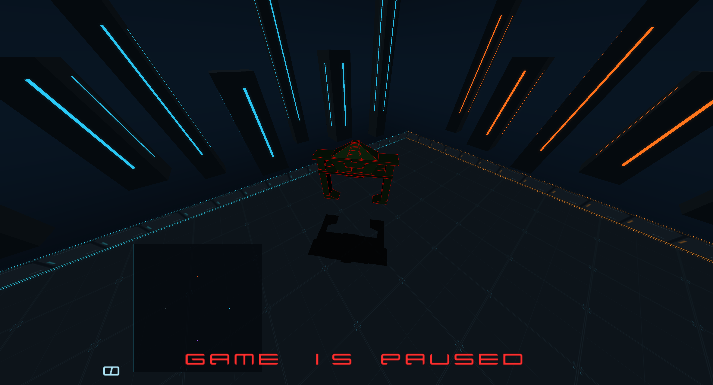

# Obsidian 0.3.0 local verification

Recorded 2026-09-13 on Linux x86-64, GeForce GTX 1660, SDL3 3.4.16,
GCC 16.2.1. This is the first original arena presentation in the complete
`vulkantron` game, following the 0.2.0 faithful renderer milestone.

## Evidence

- All 21 Release CTests and all 21 ASan/UBSan CTests passed. Relevant audio
  tests were repeated after the spatial-volume integration and passed again.
  Coverage includes the original gameplay/AI/camera/layout/input fixtures,
  tracker PCM parity, WAV loading/conversion/looping and malformed inputs,
  effect routing/fallback, boost edges, presentation reloads and audio stress.
  A final mute/unmute review added coverage for muted boost presses, discarding
  an active cue on mute, and requiring a fresh press after unmute. All four
  relevant audio tests passed again in Release and ASan/UBSan.
- The Release X11 Obsidian fixture completed 39 captures: menus, playing,
  boost/turn fixtures, four cameras, split/four-player ownership, long trails,
  crashes/results, original/Obsidian switches, resized/fullscreen/restore,
  and two actual settings save/load cycles. Vulkan and adapter errors: zero.
- Native Wayland ASan/UBSan repeated all 39 Obsidian scenes with zero Vulkan
  or adapter errors. Its logical dimensions and framebuffer dimensions differ
  at desktop scaling; captures use the complete framebuffer.
- Visual review covered the arena, cycles, trails, reflections, menu, minimap
  and split-screen. The review refined wheel-edge visibility, the wordmark,
  minimap contrast and the tower light-strip depth offset.
- The classic comparison exposed uninitialized inactive viewport rectangles:
  per-player camera and appearance component hashes matched, while hidden
  rectangles contained allocator data until four-way mode initialized them.
  Player visuals now allocate zeroed storage, and the native fixture asserts
  that initial inactive rectangles are zero. Full state hashes and pixel
  thresholds remain unchanged.
- The final original-artpack comparison passed all 39 scenes: repeated
  OpenGL states and pixels were identical, and Vulkan matched every full
  state hash and the accepted pixel limits. Only the previously documented
  coplanar exceptions for `crash-late`, `winner`, and `draw-result` applied.
  No new exception or threshold change was introduced. The Vulkan run
  completed 274 frames with zero validation or adapter errors.
- The native bloom failure gate rejected a missing fragment shader three
  times, then rendered successfully after the shader was restored, under
  ASan/UBSan and Vulkan synchronization validation. Final validation errors:
  zero. Partial allocation ownership is rolled back before any retry.
- The recorded PCM player reads/converts its bounded WAV before publication
  to the mixer. Loops and restarts do not reopen the file. All new spatial
  sources honor effects volume; the classic path retains its original PCM.
- Real PipeWire playback was captured from only the installed application's
  PID-owned FL/FR ports. The 45-second gameplay capture is stereo 22050 Hz,
  with RMS 1390 PCM, peak 8380 PCM and no clipped samples. The native game
  exited zero after 4052 frames with zero Vulkan/adapter errors. Screenshots
  and accepted input logs confirm movement, initial boost, crash, pause and
  resume. Waveform correlation identifies the authored boost 91 ms after its
  accepted key press, and the authored crash later in the match. Subsequent
  turn/retrigger inputs arrived after the player died; those paths retain
  regression-fixture coverage rather than a claim of live input verification.
  The bounded recorder returned 1 at its requested sample cap; the resulting
  WAV contains all 992250 requested frames and decodes successfully.
- Every shipped audio file decodes without clipped samples. Engine/ambient
  loops and the music edit pass sample-boundary checks. Effect synthesis and
  visual assets reproduce byte-for-byte with the recorded tools and hashes.
- The installer was tested using a real staged CMake installation. It checks
  required arena/music assets, retains previous app versions, backs up exact
  profile bytes and mode, and changes only artpack/music selection. Fresh
  profiles, repeat installation, XDG resolution, and original-profile and
  unrelated-launcher protection were checked.

## Recognizer restoration — September 15, 2026

Obsidian now draws the original recognizer and its projected floor shadow when
**Video → Detail Options → Recognizers** is enabled. The previous arena-specific
draw exclusions hid both even with that setting enabled. Its flight path,
height, original mesh and materials, sound, and observer-camera behavior remain
shared with the classic artpacks. The reflection pass leaves depth tests and
writes disabled for projected floor shadows; opaque-world drawing restores both.

- All 21 Release CTests and the comparison-policy self-test passed.
- Native Vulkan/X11 fixtures passed all 41 scenes for Obsidian and all 41 for
  the classic artpack on the GeForce GTX 1660, with zero Vulkan/adapter errors.
- The expanded recognizer fixture freezes the simulation and camera, captures
  enabled/disabled/restored states, and compares decoded RGB pixels. Disabling
  it changed 142,167 of 7,781,184 pixels in Obsidian and 147,336 in classic;
  enabling it again restored exactly the original pixels and gameplay state.
- Before/after visual inspection confirmed the mesh and floor shadow in
  Obsidian. The image below uses the fixture's elevated inspection camera.



These follow-up runs cover Release Vulkan on X11. The broader sanitizer and
OpenGL comparison results above remain the earlier recorded verification.
Detailed follow-up logs, captures, and `verification.json` are in
`/tmp/vulkantron-recognizer-20260915-6xjc7fvx/`.

## Reproduction

```sh
cmake --preset release -DGLTRON_BUILD_NATIVE_TESTS=ON
cmake --build --preset release
ctest --preset release
cmake --preset asan -DGLTRON_BUILD_NATIVE_TESTS=ON
cmake --build --preset asan
ctest --preset asan
SDL_VIDEO_DRIVER=x11 ASAN_OPTIONS=detect_leaks=0:halt_on_error=1 \
  VK_LAYER_VALIDATE_SYNC=1 build/asan/vulkantron-bloom-native-test \
  build/asan/bin/vulkantron-shaders /tmp/vulkantron-bloom-new-run
```

The existing `tools/check_vulkantron_faithful.py` runs the retained renderer
comparison. Its `run_fixture()` helper also accepts `obsidian` for native
captures, without applying faithful pixel-equivalence thresholds to the new
artistic direction. All fixture configurations and screenshots use new private
directories; the user's classic `.gltronrc` remained unchanged.

Local detailed evidence from this run:

- `/tmp/vulkantron-obsidian-release-final-tests.log`
- `/tmp/vulkantron-obsidian-asan-final-tests.log`
- `/tmp/vulkantron-obsidian-current-audio-tests.log`
- `/tmp/vulkantron-obsidian-audio-asan-confirm.log`
- `/tmp/vulkantron-obsidian-final-x11/`
- `/tmp/vulkantron-obsidian-asan-wayland/`
- `/tmp/vulkantron-bloom-retry.log`
- `/tmp/vulkantron-native-audio-review/report.json`
- `/tmp/vulkantron-obsidian-installed-gameplay/report.json`
- `/tmp/vulkantron-obsidian-installed-gameplay/sfx-correlation.json`
- `/tmp/vulkantron-obsidian-installer-8btghxf7/result.json`
- `/tmp/vulkantron-obsidian-classic-final-comparison/comparison.json`

## Limits

The Release paused-scene display/submission/presentation measurement at
3792x2052 was 16.66 ms median and 16.93 ms p95. It includes synchronization
and display waits; it is not an isolated GPU timing or a guarantee for every
match. Sanitizer instrumentation is deliberately much slower.

The compositor constrained window-size requests. Fullscreen and restoration
worked; native minimization was ignored, so hide/show restoration was tested
and recorded separately. Whole-game leak checking remains unverified because
the traced environment prevents LeakSanitizer from operating.

Reflections are an artistic floor treatment, not ray tracing. Bloom scatters
bright arena pixels before each viewport's HUD; it is not an HDR lighting
system. The soundtrack has technical validation but no recorded subjective
listening review, so musical phrasing and absence of vocals are not certified.
Other GPUs/operating systems have not been tested.
